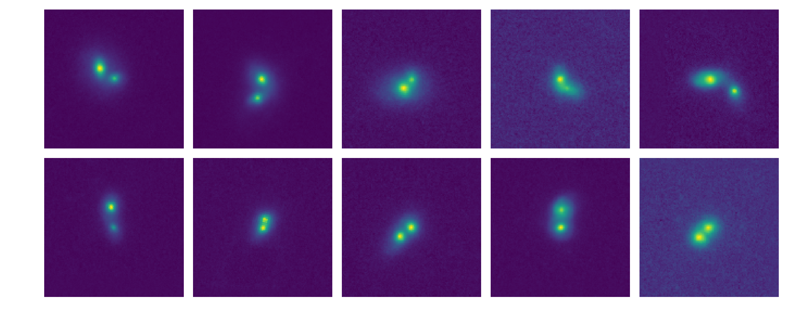

CANDELS galaxy blender
======================

Easily generate images of galaxy blends from Hubble Space Telescope data.




Table of contents
-----------------
- [Context](#Context)
- [Usage](#Usage)
- [Installation](#Install)
- [Quickstart example](#Example)

Context
-------

#### Galaxy blending


#### Input dataset

[](https://doi.org/10.5281/zenodo.2604740)

The provided input dataset comes from the CANDELS bulge/disk decomposition dataset from [Dimauro et al. (2018)](https://academic.oup.com/mnras/article-abstract/478/4/5410/5004864?redirectedFrom=fulltext) and contains stamps and segmentation maps (128 x 128 pixels) centred around isolated galaxies, and a reduced catalogue of properties in the F160W band for the central galaxies.

Our addition to the Dimauro dataset is a visual screening of the stamps to reject all those for which
- the central galaxy is possibly blended,
- the neighbouring sources are too close or too diffuse,
- the segmentation map does not cover well the sources in the stamp,
- weird artefacts are present in the stamp.

The provided dataset contains 2 001 entries.

Usage
-----

The `candels-blender` command-line interface (CLI) can be used to create a custom dataset of realistic blended galaxies
```bash
candels-blender <action>
```

Three actions are currently available via the CLI:
  - `produce`
  - `concatenate`
  - `convert`

For each action, the available options are accessible via
```bash
candels-blender <action> --help
```

#### `produce`

We select two galaxies from the input dataset. We mask out the neighbours in the image, if any, to obtain two stamps with an individual galaxy at the center. We randomly shift one galaxy out of the two and repeat the same operation for the two segmentation maps (which we also refer to as _masks_ since there is only one galaxy left).
The output catalogue contains for each entry the distance between them, the corresponding shift in _x_ and _y_-axis in pixels and the properties of both galaxies. 

We implement a train/test split for machine learning purposes. Before we produce any galaxy pair, we make sure to randomly separate input galaxies into two categories. Therefore, despite the inherent redundancy of galaxies within each split, the test sample will not contain any galaxy used in the training one.

#### `concatenate`

The blend stamps are obtained by summation of the two galaxy stamps. 
We also propose several outputs, binary masks outputs can be obtained from the segmentation maps to perform object detection tasks (see `gg_masks`, `ogg_masks` and `bogg_masks` methods in [`blender.segmap`](blender/segmap.py)).  
The individual galaxies stamps - with the one centered and the one shifted - can also be output to perform regression tasks (`single_images` method).

#### `convert`

Finally we use the magnitude of both galaxies from catalogue to output their flux in an array for regression tasks.

Installation
------------

1. Clone the repository
   ```bash
   git clone https://github.com/aboucaud/candels-blender.git
   cd candels-blender
   ```

2. Install the dependencies and the module
   - with [conda](https://www.anaconda.com/download/) or [miniconda](https://docs.conda.io/en/latest/miniconda.html)
   ```bash
   conda update conda                # Update conda
   conda env create                  # Use environment.yml to create the 'candels-blender' env
   conda activate candels-blender    # Activate the virtual env
   pip install .
   ```
   - without `conda` (**needs Python 3.6+**)
   ```bash
   python3 -m pip install -r requirements.txt
   python3 -m pip install .
   ```

3. Download the CANDELS data
   ```bash
   python3 download_data.py
   ```

Example
-------

The actions are to be used sequentially.

### 1) Create the blends and catalogue
```bash
candels-blender produce -n 20000 --exclude irr --mag_high 23.5 --test_ratio 0.3 --seed 42
```
will prepare 20 000 pairs of galaxies of magnitude above 23.5 excluding the irregular galaxies, with a train/test ratio of 70% / 30%, into a directory called `output-s_42-n_20000` along with the accompanying segmentation masks and catalogues `train/test_catalogue.csv`.

### 2) Format the images and masks into distinct files
```bash
candels-blender concatenate -d output-s_42-n_20000 --method ogg_masks --delete
```
will sum the galaxy stamps to create the blends (`train/test_blends.npy`) and use the `ogg_masks` recipe to create the masks from the segmentation maps (`train/test_ogg_masks.npy`). After that it will delete the individual files.

### 3) Obtain an array of the flux of both individual galaxies
```bash
candels-blender convert -d output-s_42-n_20000 --zeropoint=25.5
```
will use the magnitude of each galaxy, stored in the catalogues, to create the arrays of corresponding flux `train/test_flux.npy`, depending on the zero-point value.


## Notebook with figures

A notebook that briefly describes the blending process is available [here](notebooks/manual_blender.ipynb).


## Authors

Alexandre Boucaud - aboucaud _at_ apc.in2p3.fr
